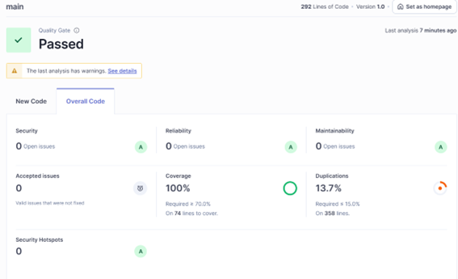
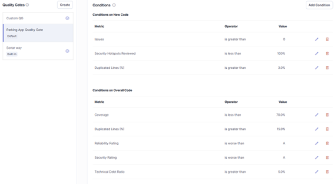

# 🚗 Parking App - Análisis y Corrección con SonarQube

## 📋 Resumen del Laboratorio

Este proyecto ha sido analizado y corregido usando **SonarQube** para identificar y solucionar vulnerabilidades de seguridad y problemas de calidad de código.

### ✅ Resultados del Análisis

**ANTES:**
- 🔴 Issues: 3 abiertos
- 🔴 Security Hotspots: 3 sin revisar (0%)
- 🔴 Security Rating: E
- 🟡 Reliability Rating: C
- 🟢 Maintainability Rating: A


*Captura del dashboard de SonarQube mostrando los issues y security hotspots antes de las correcciones*

---

**DESPUÉS:**
- 🟢 Issues: 0 abiertos
- 🟢 Security Hotspots: 3 resueltos (100%)
- 🟢 Security Rating: A
- 🟢 Reliability Rating: A
- 🟢 Maintainability Rating: A


*Captura del dashboard de SonarQube después de aplicar todas las correcciones - Quality Gate PASSED*

### 🔧 Correcciones Aplicadas (6 total)

1. ✅ **Variables var → const/let** (frontend/app.js)
2. ✅ **Atributo lang en HTML** (frontend/index.html)
3. ✅ **Password hardcodeado → Variables de entorno** (backend/config/db.js)
4. ✅ **Versión de Express oculta** (backend/server.js)
5. ✅ **Integrity checks en CDN** (frontend/index.html)
6. ✅ **Protección de archivos sensibles** (.gitignore, .env.example)

---

## 🚀 Instalación Rápida

### 1. Instalar dependencias del backend

```bash
cd backend
npm install
```

### 2. Configurar variables de entorno

```bash
# Copiar plantilla
copy .env.example .env

# Editar .env con tus credenciales
notepad .env
```

Contenido del `.env`:
```env
DB_USER=postgres
DB_HOST=localhost
DB_DATABASE=parking_db
DB_PASSWORD=tu_password_aqui
DB_PORT=5432
```

### 3. Ejecutar el backend

```bash
cd backend
npm start
```

El API estará disponible en http://localhost:3000. Prueba endpoints como http://localhost:3000/zones en un navegador o Postman.

### 4. Ejecutar el Frontend

El frontend usa ExtJS desde CDN, por lo que no necesita instalación de paquetes.
Para ejecutarlo se puede usar un servidor HTTP simple:

```bash
cd frontend
npm install -g http-server
http-server
```

Posteriormente acceder a http://localhost:8080 (o el puerto que use http-server) para ver la app. 

Alternativamente, puede abrir el archivo index.html directamente en un navegador (asegúrese de que el backend esté corriendo, ya que hace llamadas a localhost:3000).

---

## 🔍 Análisis con SonarQube

### Ejecutar análisis

```powershell
docker run --rm `
  -v "${PWD}:/usr/src" `
  sonarsource/sonar-scanner-cli
```

El archivo `sonar-project.properties` ya contiene toda la configuración necesaria.

---

## 📚 Documentación del Laboratorio

- **[sonar-project.properties](sonar-project.properties)** - Configuración de SonarQube

---

## 🎯 Principios SOLID Aplicados

- ✅ **SRP (Single Responsibility):** Separación de configuración de DB
- ✅ **DIP (Dependency Inversion):** Uso de variables de entorno
- ✅ **OCP (Open/Closed):** Configuración extensible sin modificar código

## 🏗️ Patrones de Diseño Utilizados

- ✅ **Singleton:** Pool de conexiones PostgreSQL
- ✅ **Configuration:** Externalización de configuración (.env)
- ✅ **MVC:** Arquitectura Model-View-Controller (ExtJS)

---

## 🔒 Mejoras de Seguridad

1. **Credenciales protegidas:** No más passwords en código
2. **Information disclosure prevenido:** Versión de Express oculta
3. **Supply chain security:** Integrity checks en recursos CDN
4. **Archivos sensibles protegidos:** .gitignore configurado
5. **Código moderno:** const/let en lugar de var
6. **Accesibilidad mejorada:** Atributo lang en HTML

---

## 📊 Quality Gates Configuradas

1. **Seguridad:** Rating A (sin vulnerabilidades críticas), todos los Security Hotspots revisados
2. **Mantenibilidad:** Deuda técnica < 5%
3. **Código duplicado:** Máximo 15%
4. **Confiabilidad:** Rating A
5. **Coverage:** Mayor al 70%


*Configuración de Quality Gates en SonarQube con las reglas principales*

---

## 👥 Información del Laboratorio

- **Curso:** Desarrollo de Software Seguro
- **Institución:** Universidad de las Fuerzas Armadas ESPE
- **Fecha:** 8 de enero de 2026
- **Duración:** 2 horas
- **Puntaje máximo:** 20 puntos

---

## 📝 Notas Importantes

⚠️ **NUNCA** commitear el archivo `.env` a Git (ya está en .gitignore)  
✅ Usar siempre `.env.example` como plantilla  
✅ Ejecutar `npm install` después de clonar  
✅ Configurar `.env` antes de ejecutar el backend